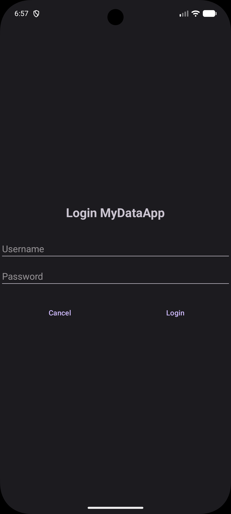
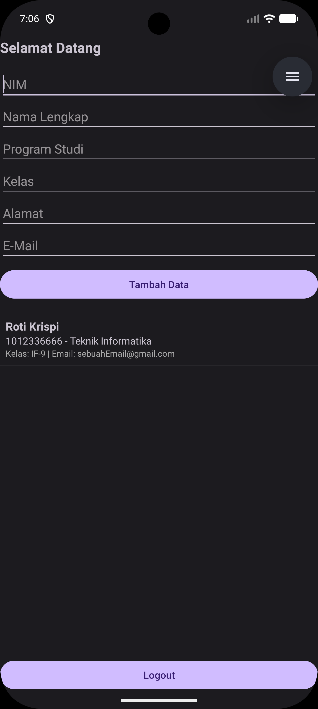

# MyDataApp - Proyek UTS Pemrograman Android

Aplikasi **MyDataApp** adalah proyek Ujian Tengah Semester (UTS) untuk mata kuliah Pemrograman Android. Aplikasi ini dirancang untuk mendemonstrasikan pengelolaan data pengguna secara aman menggunakan enkripsi sederhana (SharedPreferences) dan pengelolaan data dinamis menggunakan ListView.

## 📝 Fitur Utama

### 1. Sistem Login Keamanan
- Verifikasi kredensial menggunakan mekanisme hardcoded (`admin` & `admin123`).
- Fitur **Cancel** untuk meriset input form login.
- Validasi input dengan pesan kesalahan (Toast) jika data kosong atau salah.

### 2. Manajemen Sesi (Session Management)
- Menggunakan **SharedPreferences** untuk menyimpan status login (`isLoggedIn`).
- Pengguna yang sudah login akan langsung diarahkan ke Dashboard saat membuka aplikasi (Auto-login).
- Fitur **Logout** untuk menghapus sesi dan kembali ke halaman login.

### 3. Manajemen Data Dinamis
- Form input data mahasiswa lengkap (NIM, Nama, Prodi, Kelas, Alamat, E-mail).
- Menampilkan daftar data yang telah diinput secara real-time menggunakan **ListView**.
- Custom Adapter untuk tampilan item data yang rapi.

## 🚀 Teknologi yang Digunakan
- **Bahasa**: Java
- **UI Layout**: XML (LinearLayout)
- **Penyimpanan**: SharedPreferences
- **Komponen**: Activity, Intent, ListView, ArrayAdapter, Toast, Edge-to-Edge UI.
- **Minimum SDK**: 34 (Android 14)

## 📸 Tampilan Aplikasi

|                        Halaman Login                         |                          Halaman Dashboard                           |
|:------------------------------------------------------------:|:--------------------------------------------------------------------:|
|  |  |

## 🛠️ Cara Menjalankan
1. Clone repository ini ke komputer Anda.
2. Buka proyek menggunakan **Android Studio**.
3. Sinkronisasi proyek dengan Gradle.
4. Jalankan aplikasi pada Emulator atau Perangkat Fisik (**Min SDK 34 / Android 14**).

## 📄 Lisensi
Proyek ini dilisensikan di bawah [MIT License](LICENSE).

---
**Dosen Pengampu**: Dr. Sopian Alviana, S.Kom., M.Kom  
**Status Proyek**: Selesai (UTS Take Home Test)
